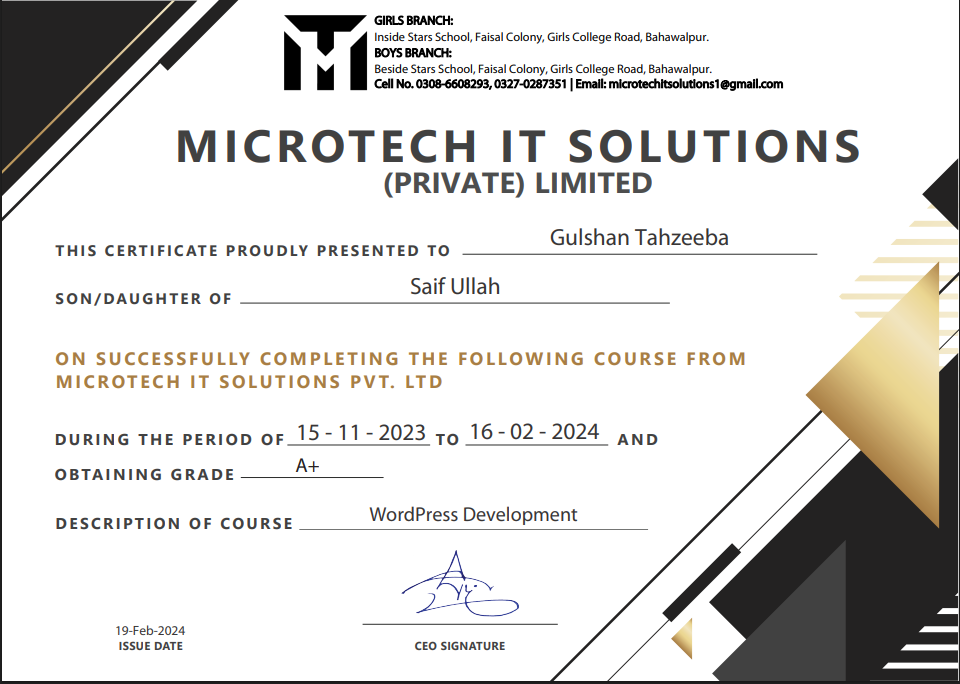
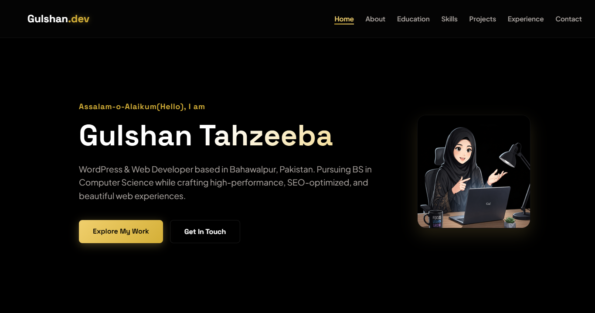
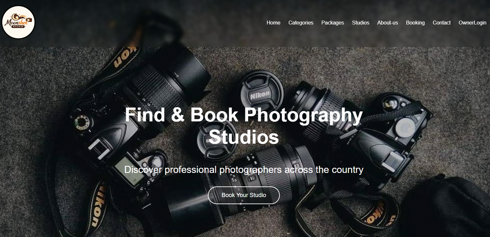
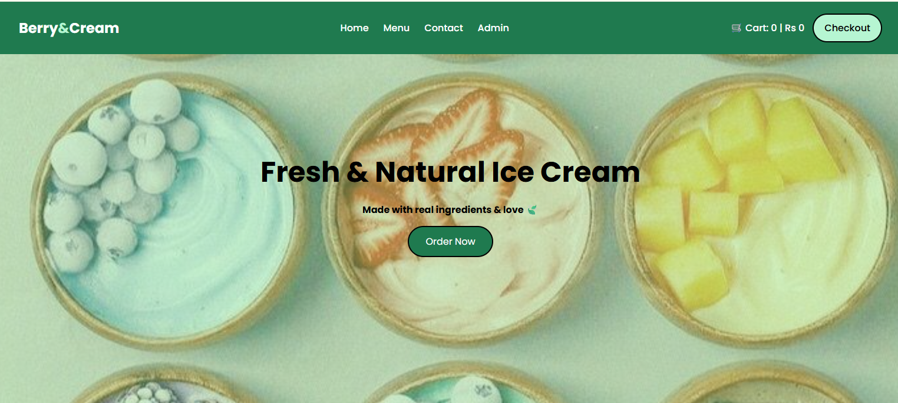
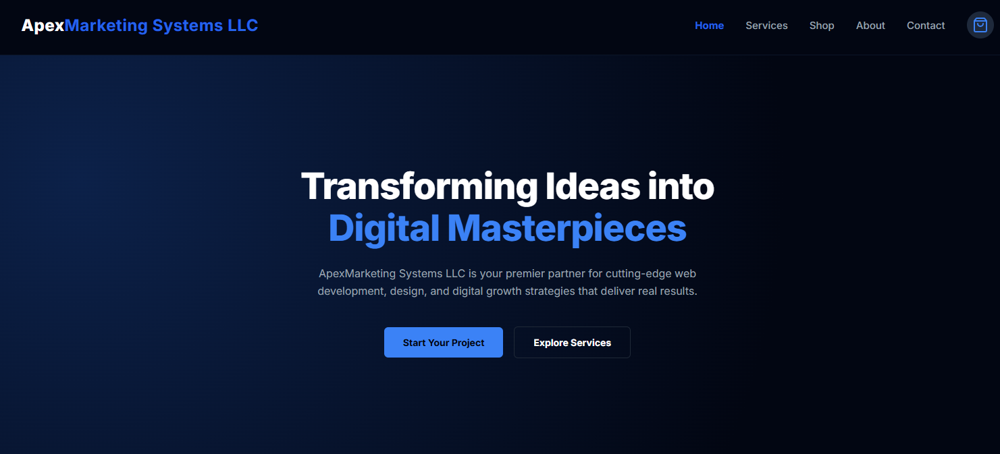
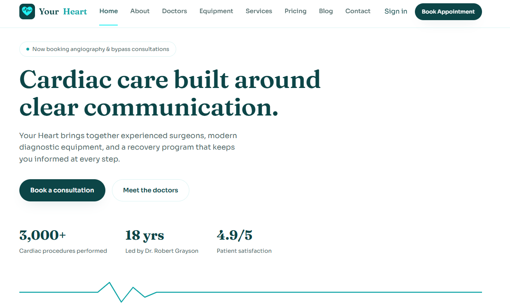
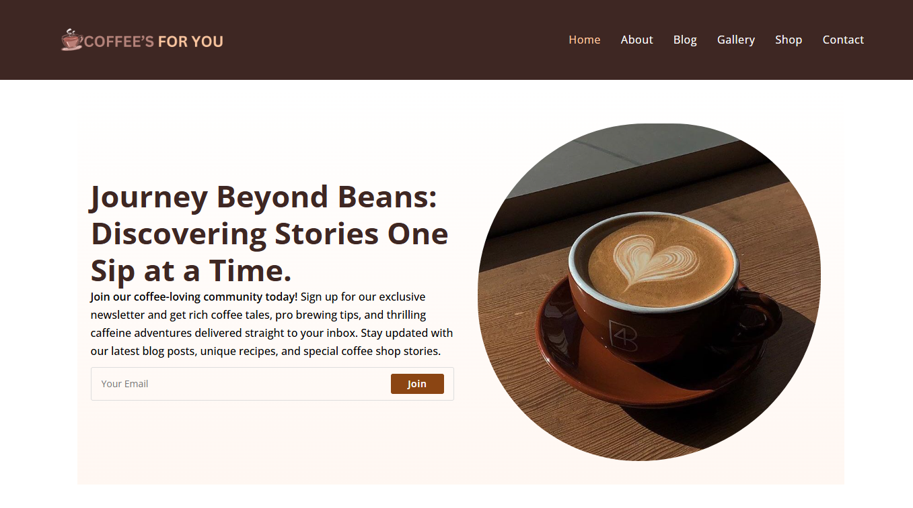
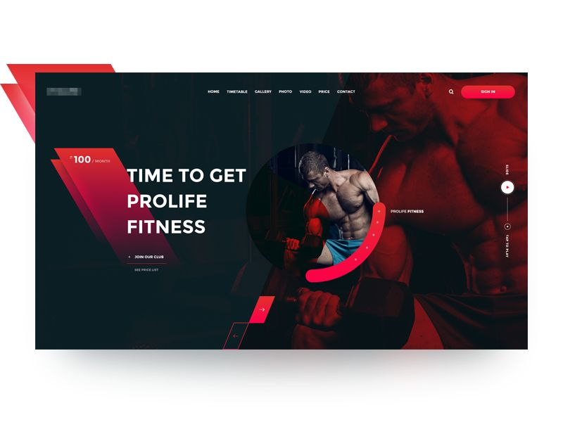

 

### 🌻 About Me

Hi, I'm Gulshan — a WordPress and full stack developer based in Bahawalpur, Pakistan, currently in my 6th semester of a Computer Science degree at The Islamia University of Bahawalpur. I enjoy taking an idea from a blank page to a live, working website — from business landing pages to booking platforms — and I care about clean design as much as clean code. Alongside development, I've also worked in lead generation and content writing, which shapes how I build: not just functional sites, but ones designed to actually convert visitors into customers. I'm currently interning as a Full Stack Developer and teaching WordPress development at Vartexsoft.

### 🎓 Education

| 🏫 Institution | 🎓 Program | 📅 Status |
|---|---|---|
| The Islamia University of Bahawalpur | BS Computer Science | 6th Semester |

### 📜 Certifications

| Certificate | Issuer | Details |
|---|---|---|
| WordPress Development | Microtech IT Solutions, Bahawalpur | Grade: A+ · Nov 2023 – Feb 2024 |

### 💼 Experience

| Role | Organization | Duration |
|---|---|---|
| 🧑‍💻 Full Stack Developer Intern | Vartexsoft | Current |
| 🧑‍🏫 WordPress Instructor | Vartexsoft | Current |
| 📈 Lead Generation Expert | Leadvora Solutions | 6 months |
| 📈 Lead Generation Expert | LeadGen | 3 months |

### 🛠️ Tech Stack & Skills

  

`WordPress Developer` `Full Stack Developer` `Lead Generation Expert` `Content Writer`

### 🚀 Featured Projects

<table>
<tr>
<td width="50%" valign="top">

**🌐 [My Portfolio](https://github.com/gulshantahzeeba-57/My_Portfolio)**
Personal portfolio showcasing my skills, studies, and projects.
`HTML` `CSS` `JS`
[Live Demo →](https://gulshantahzeeba-57.github.io/My_Portfolio/)

</td>
<td width="50%" valign="top">

**📸 [Photography Studio Booking](https://github.com/gulshantahzeeba-57/Photography-Studio_Booking-Website.)**
Browse top photographers in Pakistan and book the one that fits your style.
`HTML` `CSS` `JS`
[Live Demo →](https://gulshantahzeeba-57.github.io/Photography-Studio_Booking-Website./)

</td>
</tr>
<tr>
<td width="50%" valign="top">

**🍦 [Berry Cream Ice Cream](https://github.com/gulshantahzeeba-57/Berry-Cream-Ice-Cream)**
Ice cream shop site with a menu, prices, and ordering.
`HTML` `CSS` `JS`
[Live Demo →](https://gulshantahzeeba-57.github.io/Berry-Cream-Ice-Cream/)

</td>
<td width="50%" valign="top">

**📈 [ApexMarketing Systems LLC](https://gulshantahzeeba-57.github.io/ApexMarketing-Systems-LLC-Project/)**
Digital agency site for businesses growing their online presence.
`HTML` `CSS` `JS`
[Live Demo →](https://gulshantahzeeba-57.github.io/ApexMarketing-Systems-LLC-Project/)

</td>
</tr>
<tr>
<td width="50%" valign="top">

**❤️ [Your Heart Cardiac Clinic](https://github.com/gulshantahzeeba-57/Your-Heart-Cardiac-Clinic-Website)**
Multi-page clinic site — doctors, equipment, services, pricing, blog & appointment booking.
`HTML` `CSS` `JS`
[Live Demo →](https://gulshantahzeeba-57.github.io/Your-Heart-Cardiac-Clinic-Website/)

</td>
<td width="50%" valign="top">

**☕ Coffee's For You** (WordPress)
A WordPress site for a coffee brand — blog, gallery, shop and newsletter sign-up.
`WordPress`

</td>
</tr>
<tr>
<td width="50%" valign="top">

**🏋️ FlexCore Gym**
A gym e-commerce style site featuring gym products.
`HTML` `CSS` `JS`

</td>
<td width="50%" valign="top">

</td>
</tr>
</table>

### 📊 GitHub Stats

### 🕹️ Contribution Graph — Pac-Man Edition

⚙️ This animates automatically once the Pac-Man GitHub Action below is set up in your profile repo.

